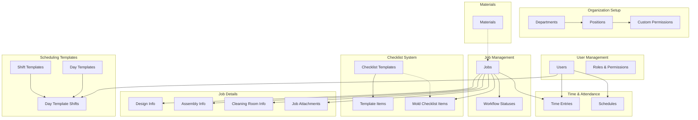
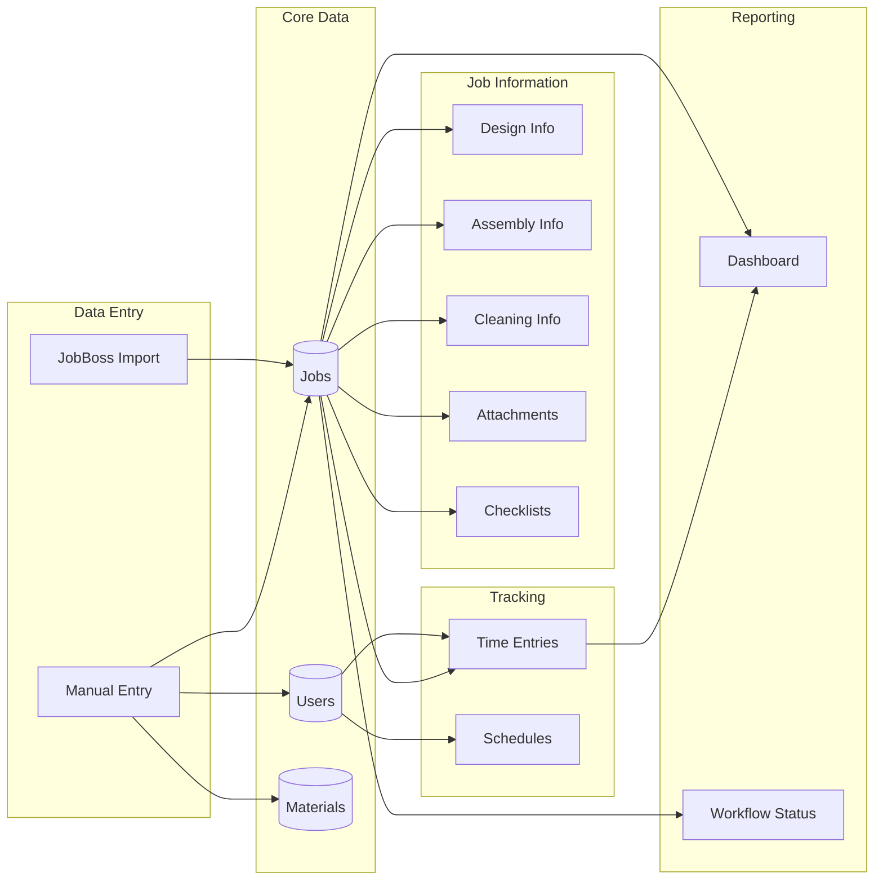
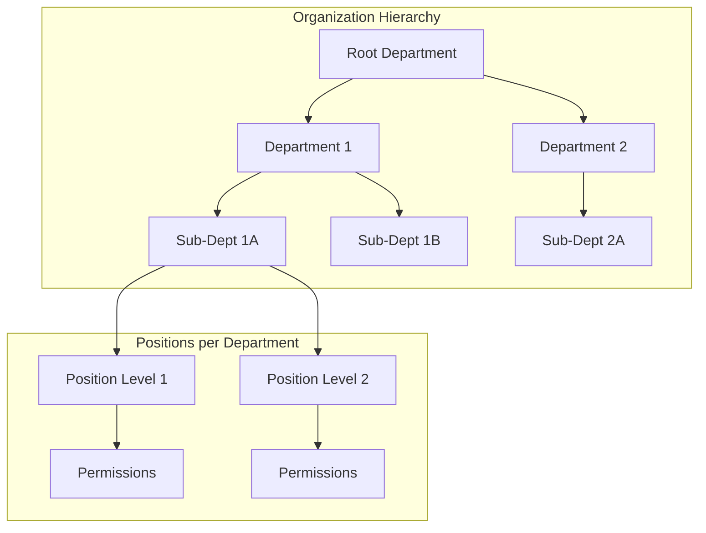
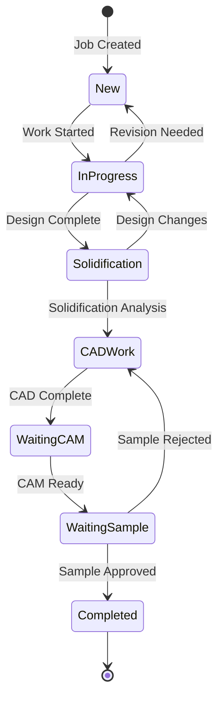
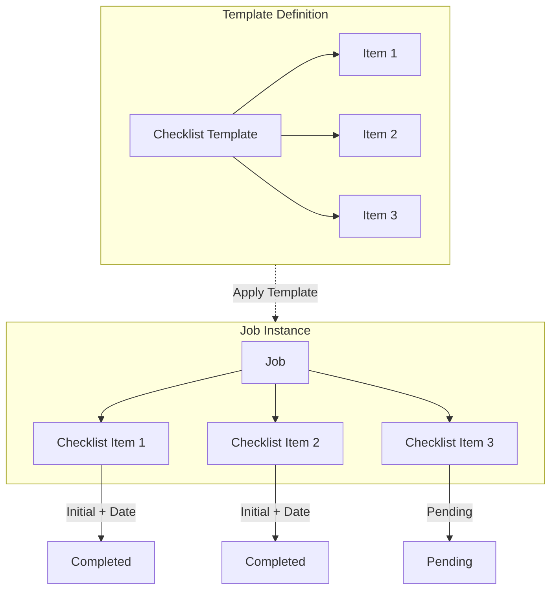

# Foundry Management System - Entity Relationship Diagram

## Complete Entity Relationship Diagram

```mermaid
erDiagram
    %% User Management
    users {
        varchar id PK
        text username UK
        text password
        text name
        text email UK
        text role
        text[] permissions
    }

    %% Organization Hierarchy
    departments {
        varchar id PK
        text name
        text description
        varchar parent_department_id FK
        text color
    }

    positions {
        varchar id PK
        text name
        text description
        varchar department_id FK
        integer level
    }

    custom_permissions {
        varchar id PK
        text name UK
        text description
        text module
    }

    position_permissions {
        varchar id PK
        varchar position_id FK
        varchar permission_id FK
    }

    %% Job Management
    jobs {
        varchar id PK
        text status
        text task
        text company
        text part_number
        text job_number
        text mold_size
        text material
        text pour_weight
        text owner
        text quantity_needed
        integer quantity_completed
        text molds_needed
        text certs
        text custom_chills
        text cores_ordered
        text promised_date
        text heat_treat
        text assembly_code
        text est_assembly_time
        text model_approved
        text notes
        text inform_melt
        text molds_split_off
    }

    %% Job Related Information
    design_info {
        varchar id PK
        varchar job_id FK
        text solidification_gating
        text quality
        text sprues
        text basin_size
        text feeders
        text chills
        text gating_system
        text mold_coating
    }

    assembly_info {
        varchar id PK
        varchar job_id FK
        text mold_size
        text paint
        text robot_time_cope
        text robot_time_drag
        text mpi_certed
        text assembly_notes
        text core_boxes
        text special_tooling
    }

    cleaning_room_info {
        varchar id PK
        varchar job_id FK
        text clean_time
        text mold_rating
        text pouring_pictures
        text casting_pictures
        text core_assembly
        text core_cost
        text mold_assembly
        text casting_weight_lbs
        text pour_point
        text assembly
        text additional_notes_initial
    }

    job_attachments {
        varchar id PK
        varchar job_id FK
        text file_name
        text file_type
        text attachment_type
        text file_path
        text local_file_path
        text file_size
        text uploaded_at
    }

    %% Checklist System
    checklist_templates {
        varchar id PK
        text name
        text description
    }

    checklist_template_items {
        varchar id PK
        varchar template_id FK
        text item_description
        integer order_index
    }

    mold_design_checklist_items {
        varchar id PK
        varchar job_id FK
        text item
        text initial
        text date
        text notes
    }

    %% Materials
    materials {
        varchar id PK
        text code
        text description
        text document_path
    }

    %% Time and Attendance
    time_entries {
        varchar id PK
        varchar user_id FK
        varchar job_id FK
        text clock_in
        text clock_out
        integer pieces_completed
        text notes
    }

    %% Scheduling
    schedules {
        varchar id PK
        varchar user_id FK
        text department
        text date
        text start_time
        text end_time
        text status
        text notes
    }

    shift_templates {
        varchar id PK
        text name
        text start_time
        text end_time
        text description
        text color
    }

    day_templates {
        varchar id PK
        text name
        integer day_of_week
        text description
        boolean is_active
    }

    day_template_shifts {
        varchar id PK
        varchar day_template_id FK
        varchar shift_template_id FK
        text department
        varchar user_id FK
        text notes
    }

    %% Workflow Status
    workflow_statuses {
        varchar id PK
        text task
        text color
    }

    %% Relationships
    users ||--o{ time_entries : "tracks time"
    users ||--o{ schedules : "has schedules"
    users ||--o{ day_template_shifts : "assigned to"

    departments ||--o{ positions : "contains"
    departments ||--o| departments : "parent of"

    positions ||--o{ position_permissions : "has"
    custom_permissions ||--o{ position_permissions : "assigned to"

    jobs ||--|| design_info : "has"
    jobs ||--|| assembly_info : "has"
    jobs ||--|| cleaning_room_info : "has"
    jobs ||--o{ job_attachments : "has"
    jobs ||--o{ mold_design_checklist_items : "has"
    jobs ||--o{ time_entries : "worked on"

    checklist_templates ||--o{ checklist_template_items : "contains"

    day_templates ||--o{ day_template_shifts : "includes"
    shift_templates ||--o{ day_template_shifts : "used in"
```



## Module Relationships Overview



## Data Flow Diagram



## Department Hierarchy Structure



## Job Lifecycle State Diagram



## Scheduling Relationships

```mermaid
erDiagram
    shift_templates {
        varchar id PK
        text name
        text start_time
        text end_time
        text color
    }

    day_templates {
        varchar id PK
        text name
        integer day_of_week
        boolean is_active
    }

    day_template_shifts {
        varchar id PK
        varchar day_template_id FK
        varchar shift_template_id FK
        varchar user_id FK
        text department
    }

    schedules {
        varchar id PK
        varchar user_id FK
        text date
        text start_time
        text end_time
        text status
    }

    users {
        varchar id PK
        text name
        text role
    }

    shift_templates ||--o{ day_template_shifts : "defines"
    day_templates ||--o{ day_template_shifts : "contains"
    users ||--o{ day_template_shifts : "assigned"
    users ||--o{ schedules : "has"
    day_template_shifts -.-> schedules : "generates"
```

## Checklist System Flow



---

*Last Updated: November 2024*
